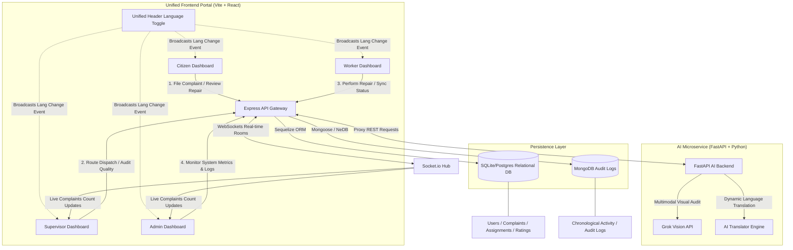

# 🏙️ CivicAI – AI-Powered Smart Public Grievance & Urban Issue Resolution Platform

> **Hackathon Submission Category:** Smart Cities & AI-Driven Governance
> *Tagline: "See it. Capture it. Track it. Verify it. Improve your city together."*
> 
> **🌐 Live Production URL:** [https://civic-ai-snowy-eight.vercel.app/](https://civic-ai-snowy-eight.vercel.app/)

---

## 🏆 Introduction & Value Proposition
**CivicAI** is a production-grade, closed-loop municipal grievance management portal. Traditional grievance systems suffer from slow manual sorting, duplicate report spam, lack of geolocated dispatches, and citizen dissatisfaction due to incomplete repairs. 

CivicAI solves these challenges by combining:
1. **Multimodal AI Intake**: Real-time Grok Vision analysis to automatically identify issues (potholes, garbage leaks, open manholes) from uploads or live browser camera snapshots.
2. **Spatial Routing**: Automated dispatch agent utilizing the **Haversine formula** to locate and assign the closest field crew based on live GPS tracking.
3. **Closed-Loop Verification**: Citizens can rate repair work or **Reject Repair Quality**, escalating incomplete fixes directly to supervisors.
4. **AI-Enabled Quality Audits**: Supervisors can compare before/after images using Grok Vision to approve resolutions or re-assign them to workers.

---

## 🏗️ Technical Architecture Diagram

The system operates on a modular, event-driven service architecture designed to scale:



---

## 🚀 Core Features (Explain Everything)

### 1. Instant AI Hazard Identification (Grok Vision)
* Citizens can upload an image or **activate their live browser camera** to take a snapshot of the hazard (e.g. pothole, garbage pile, water leakage).
* The FastAPI backend passes the image to the **Grok Vision** model.
* It uses advanced multimodal visual reasoning to automatically identify the issue, classify the category, write a formal description, assign a department, and estimate severity.
* **Deterministic Fallback**: If Grok is offline or API keys are missing, a local pixel-analysis heuristic engine combined with filename keyword matching resolves the category, ensuring the form remains dynamic and never gets stuck.

### 2. Spatial Dispatch Sorting (Haversine Formula)
* When a complaint is filed, the Express backend extracts its GPS coordinates.
* It filters workers registered under the corresponding municipal department who are currently online and idle.
* It calculates the exact distance using the **Haversine formula**:
  $$d = 2r \arcsin\left(\sqrt{\sin^2\left(\frac{\Delta \phi}{2}\right) + \cos(\phi_1)\cos(\phi_2)\sin^2\left(\frac{\Delta \lambda}{2}\right)}\right)$$
* The closest worker is assigned the task, status shifts to `assigned`, and a WebSocket notification is sent to the worker's dashboard.

### 3. Closed-Loop Quality Verification & Rejection
* When a technician marks the repair as `completed` by uploading a resolution photo, the citizen is notified.
* The citizen has two options:
  * **Verify & Close**: Rate repair quality (1-5 stars). Completing this closes the issue and awards **15 Civic Loyalty Points** to the citizen.
  * **Reject Repair**: Flags repair quality as inadequate, moving the ticket to status `citizen_rejected` and routing the issue directly to the department supervisor.

### 4. Supervisor Quality Audits
* The supervisor dashboard displays pending verifications and citizen rejections.
* **AI Quality Assessment**: The supervisor can trigger a visual before/after image comparison using Grok Vision to compute a repair confidence score.
* If the supervisor approves (even if previously rejected by the citizen), the issue transitions to `closed`. If the supervisor agrees with the rejection, they click **Send back to worker**, resetting the ticket status to `work_started`.

### 5. Multi-lingual Settings
* Toggle configurations supporting **English**, **Telugu (తెలుగు)**, and **Hindi (హిन्दी)** with persistent local storage.

---

## 🛠️ Technology Stack

* **Frontend**: React (Vite) + Tailwind CSS + Leaflet maps + Lucide Icons + Recharts (Analytics Charts)
* **Web Backend**: Node.js + Express.js + Socket.io (WebSockets)
* **AI Core Backend**: FastAPI + Python + Grok Vision (xAI API)
* **Databases**:
  * **Relational Store**: PostgreSQL (SQLite fallback) mapping Users, Workers, Complaints, Assignments, Ratings, and Verifications.
  * **NoSQL Store**: MongoDB (NeDB fallback) logging chronological Audit logs and notifications.

---

## 🔑 Pre-Seeded Hackathon Credentials

Test all five dashboards out-of-the-box using the pre-seeded credentials:

| Role | Username / Email | Password | Primary Action Panel |
| :--- | :--- | :--- | :--- |
| **System Admin** | `admin@civicai.org` | `Admin@123` | Analytics deck, direct worker creation, audit logs. |
| **Supervisor** | `supervisor@civicai.org` | `Supervisor@123` | Manual worker dispatch, verify completed repairs, AI image compares. |
| **Citizen** | `citizen@civicai.org` | `Citizen@123` | Incident filing, map picker, ratings & rejections. |
| **Worker (Roads)** | `worker@civicai.org` | `Worker@123` | Accepts jobs, updates status timeline, uploads proof photo, offline cache. |
| **Worker (Water)** | `worker_water@civicai.org` | `Worker@123` | Accepts jobs, updates status timeline, uploads proof photo, offline cache. |
| **Worker (Sanitation)** | `worker_sanitation@civicai.org` | `Worker@123` | Accepts jobs, updates status timeline, uploads proof photo, offline cache. |
| **Worker (Electricity)** | `worker_electricity@civicai.org` | `Worker@123` | Accepts jobs, updates status timeline, uploads proof photo, offline cache. |
| **Worker (Traffic)** | `worker_traffic@civicai.org` | `Worker@123` | Accepts jobs, updates status timeline, uploads proof photo, offline cache. |
| **Worker (Parks)** | `worker_parks@civicai.org` | `Worker@123` | Accepts jobs, updates status timeline, uploads proof photo, offline cache. |

---

## ⚙️ Step-by-Step Installation Guide

### Prerequisites
- Node.js (v18+)
- Python (v3.10+)

### Running Services Locally

#### 1. Setup FastAPI AI Service
```bash
cd ai_service
pip install -r requirements.txt
# To run Grok Vision and dynamic fallbacks:
python -m uvicorn app.main:app --host 127.0.0.1 --port 8001 --reload
```

#### 2. Setup Express Backend
```bash
cd backend
npm install
# Synchronizes schemas and seeds database tables
npm start
```

#### 3. Setup React Frontend
```bash
cd frontend
npm install
npm run dev
```
Open `http://localhost:5173/` in your browser.

---

## 🧪 Integration Tests Suite
Execute the backend unit and integration test coverage suite:
```bash
cd backend
node tests/api.test.js
```
